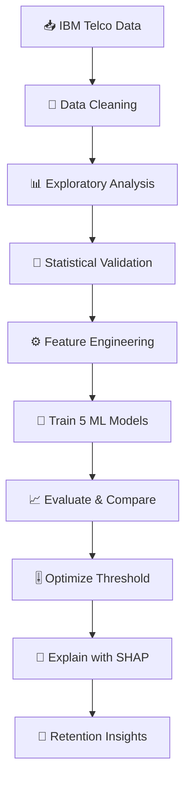
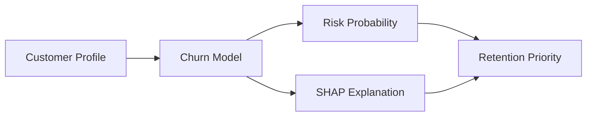

<div align="center">

# 📡 Customer Churn Prediction & Business Intelligence

### Turning telecom customer data into explainable, retention-focused decisions

[](https://www.python.org/)
[](https://scikit-learn.org/)
[](https://shap.readthedocs.io/)
[](#)

**An end-to-end classification project combining statistical validation, business-driven feature engineering, five machine-learning models, threshold optimization, and explainable AI.**

[🎯 Business Problem](#-business-problem) •
[🔄 Workflow](#-end-to-end-workflow) •
[🏆 Results](#-model-performance) •
[💡 Insights](#-business-insights) •
[📁 Structure](#-repository-structure)

</div>

---

## 👀 Recruiter Snapshot

| Area | What this project demonstrates |
|---|---|
| **Business objective** | Identify customers at risk of churn and support proactive retention |
| **Data** | IBM Telco Customer Churn dataset; **7,021 cleaned customer records** |
| **Analytical depth** | EDA, chi-square tests, independent-samples t-tests, and correlation analysis |
| **Feature engineering** | **26 business-driven features**, producing a 46-column modelling dataset |
| **Model comparison** | Logistic Regression, Decision Tree, Random Forest, LightGBM, and XGBoost |
| **Best baseline** | **Logistic Regression — ROC-AUC 84.16%** |
| **Business-focused optimization** | Threshold tuning increased churn recall to approximately **74%** |
| **Explainability** | SHAP global and customer-level explanations |
| **Business output** | Actionable retention strategies for high-risk customer segments |

> **Key result:** Threshold optimization intentionally trades some precision for higher recall, helping the business identify substantially more potential churners before they leave.

---

## 🎯 Business Problem

Customer churn directly affects recurring revenue and customer lifetime value. A telecom business therefore needs more than a prediction—it needs to understand **who may churn, which factors contribute to that risk, and how to act on the result**.

This project answers four practical questions:

1. 🔍 Which customer characteristics are associated with churn?
2. 🤖 How accurately can churn be predicted?
3. ⚖️ Which decision threshold best supports retention outreach?
4. 🧠 Can each prediction be explained to business stakeholders?

---

## 📊 Dataset at a Glance

The project uses the [IBM Telco Customer Churn dataset](https://www.kaggle.com/datasets/blastchar/telco-customer-churn).

| Category | Examples |
|---|---|
| 👤 Demographics | Gender, senior-citizen status, partner, dependents |
| ⏳ Customer relationship | Tenure and contract type |
| 🌐 Services | Phone, internet, security, technical support, streaming |
| 💳 Billing | Monthly charges, total charges, payment method |
| 🎯 Target | Churn status |

- **Cleaned observations:** 7,021
- **Observed churn rate:** approximately 26.45%
- **Final feature-engineered dataset:** 7,021 rows × 46 columns

---

## 🔄 End-to-End Workflow



<details>
<summary><strong>🔎 View the work completed in each phase</strong></summary>

### 1. Data cleaning

- Detected and removed duplicates
- Assessed missing values
- Corrected data types and converted numerical fields
- Encoded the churn target

### 2. Exploratory data analysis

- Analysed churn distribution, tenure, charges, contracts, internet service, payment methods, and service usage
- Compared customer profiles across churn outcomes

### 3. Statistical analysis

- Applied chi-square tests to categorical variables
- Used independent-samples t-tests for numerical comparisons
- Examined correlations
- Used a significance level of **α = 0.05**

### 4. Business-driven feature engineering

Created 26 features, including:

`TenureGroup` · `IsNewCustomer` · `LongTermCustomer` · `ServiceCount` ·
`SecurityServices` · `PremiumUser` · `RevenueSegment` ·
`AvgChargePerMonth` · `LongTermContract` · `AutoPayment` ·
`FiberCustomer` · `CustomerValueScore` · `LoyaltyScore` · `HighRiskCustomer`

### 5. Modelling and explainability

- Compared five classification algorithms
- Evaluated accuracy, precision, recall, F1-score, and ROC-AUC
- Tuned the classification threshold around business priorities
- Used SHAP for global feature importance and individual customer explanations

</details>

---

## 🏆 Model Performance

| Model | Accuracy | Precision | Recall | F1-score | ROC-AUC |
|:---|---:|---:|---:|---:|---:|
| 🥇 **Logistic Regression** | **80.78%** | **67.96%** | **51.88%** | **58.84%** | **84.16%** |
| Random Forest | 79.50% | 65.33% | 48.12% | 55.42% | 83.82% |
| XGBoost | 77.79% | 60.20% | 47.58% | 53.15% | 83.02% |
| LightGBM | 78.29% | 61.20% | 49.19% | 54.55% | 82.98% |
| Decision Tree | 78.79% | 64.68% | 43.82% | 52.24% | 82.05% |

### Why Logistic Regression won

Logistic Regression produced the strongest baseline ROC-AUC while remaining transparent and easy to communicate. This made it a strong fit for a business setting where both predictive performance and interpretability matter.

### 🎚️ Threshold Optimization

A default threshold is not always the best business decision. Missing a true churner can be more costly than contacting a customer who ultimately stays, so the threshold was adjusted to detect more at-risk customers.

| Metric | Optimized result |
|---|---:|
| 🎯 Recall | **~74%** |
| 🔎 Precision | **~53%** |
| ⚖️ F1-score | **~62%** |
| ✅ Accuracy | **~76%** |

**Interpretation:** The optimized model captures more potential churners, creating a larger intervention window for the retention team.

---

## 🧠 Explainable AI with SHAP

Prediction alone does not tell a business what to do. SHAP was used to connect model output with understandable customer-level reasoning.



The explainability analysis includes:

- 🌍 Global feature importance
- 📉 SHAP summary and dependence plots
- 👤 Individual customer explanations
- 💧 Waterfall and force plots
- 💼 Translation of predictive factors into business actions

Important predictive factors were associated with **tenure, charges, service usage, internet service, contract type, and support/security services**.

---

## 💡 Business Insights

| Observed pattern | Potential retention response |
|---|---|
| 🆕 New or low-tenure customers may require early attention | Improve onboarding and schedule early engagement |
| 📄 Contract type is associated with churn behaviour | Offer relevant longer-term contract incentives |
| 💸 Charges contribute to customer risk profiles | Review pricing perceptions and personalize offers |
| 🛡️ Support and security-service usage matters | Bundle technical support and security services |
| 🌐 Internet-service characteristics help distinguish risk | Design service-specific retention campaigns |
| 🚨 High predicted probability + SHAP risk drivers | Prioritize the customer for targeted intervention |

> The project identifies **predictive associations**, not causal effects. Retention actions should be validated through controlled business experiments.

---

## 🛠️ Technology Stack

| Category | Tools |
|---|---|
| 💻 Language | Python |
| 🧹 Data manipulation | Pandas, NumPy |
| 📊 Visualization | Matplotlib |
| 🧪 Statistical analysis | Chi-square tests, t-tests, correlation analysis |
| 🤖 Machine learning | Scikit-learn, LightGBM, XGBoost |
| 🧠 Explainable AI | SHAP |
| 📓 Development | Google Colab, Jupyter Notebook |

---

## 📁 Repository Structure

```text
Customer-Churn-Prediction/
│
├── README.md
├── notebooks/
│   ├── 01_Data_Cleaning.ipynb
│   ├── 02_EDA.ipynb
│   ├── 03_Statistical_Analysis.ipynb
│   ├── 04_Feature_Engineering.ipynb
│   └── 05_Feature_Selection_Machine_Learning.ipynb
├── results/
├── visuals/
└── requirements.txt
```

---

## 🚀 How to Explore the Project

1. Review the notebooks in numerical order.
2. Begin with data cleaning and EDA to understand the customer population.
3. Continue to statistical analysis and business-driven feature engineering.
4. Open the modelling notebook to compare algorithms and threshold results.
5. Review SHAP outputs to connect predictions with retention decisions.

---

## 🌟 What Makes This Project Different?

- ✅ Goes beyond model accuracy by connecting evaluation to a real business cost
- ✅ Combines statistical inference with machine learning
- ✅ Engineers features using telecom and customer-lifecycle logic
- ✅ Compares linear, tree-based, bagging, and boosting approaches
- ✅ Makes predictions understandable through SHAP
- ✅ Converts technical output into practical retention recommendations

---

<div align="center">

### ⭐ If this project helped you, consider starring the repository

**Built as an end-to-end applied statistics, machine-learning, and business-intelligence project.**

</div>
